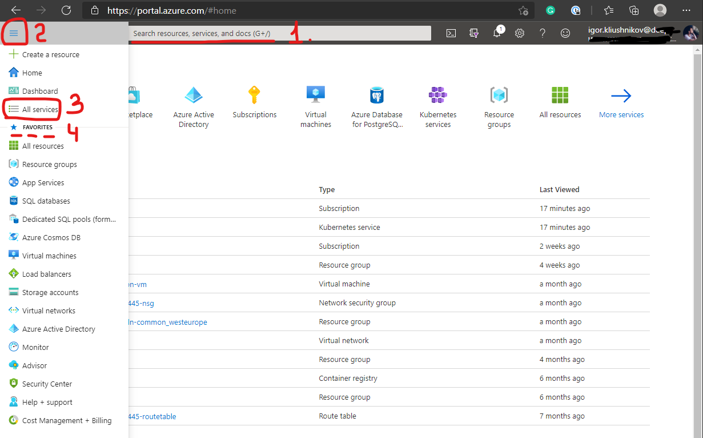
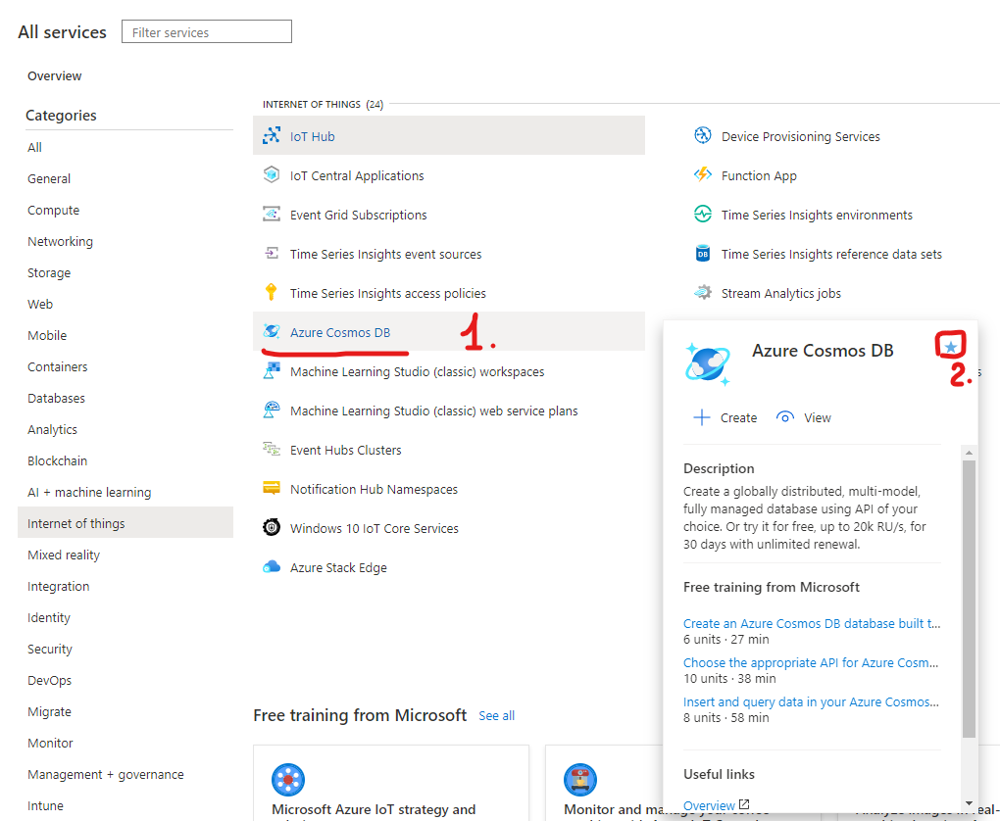
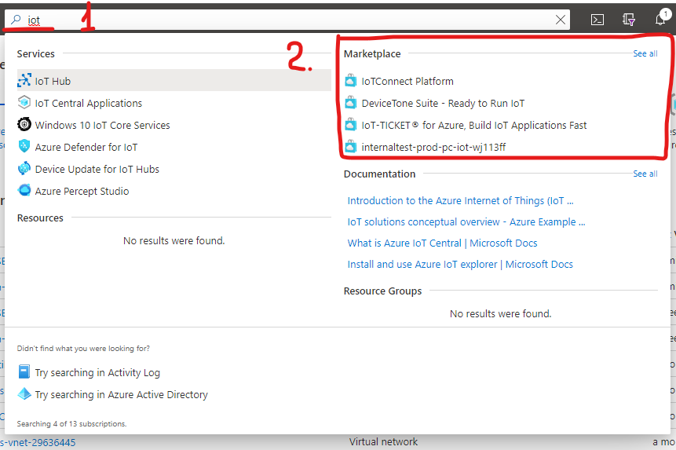
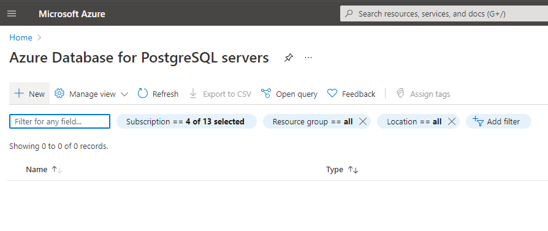
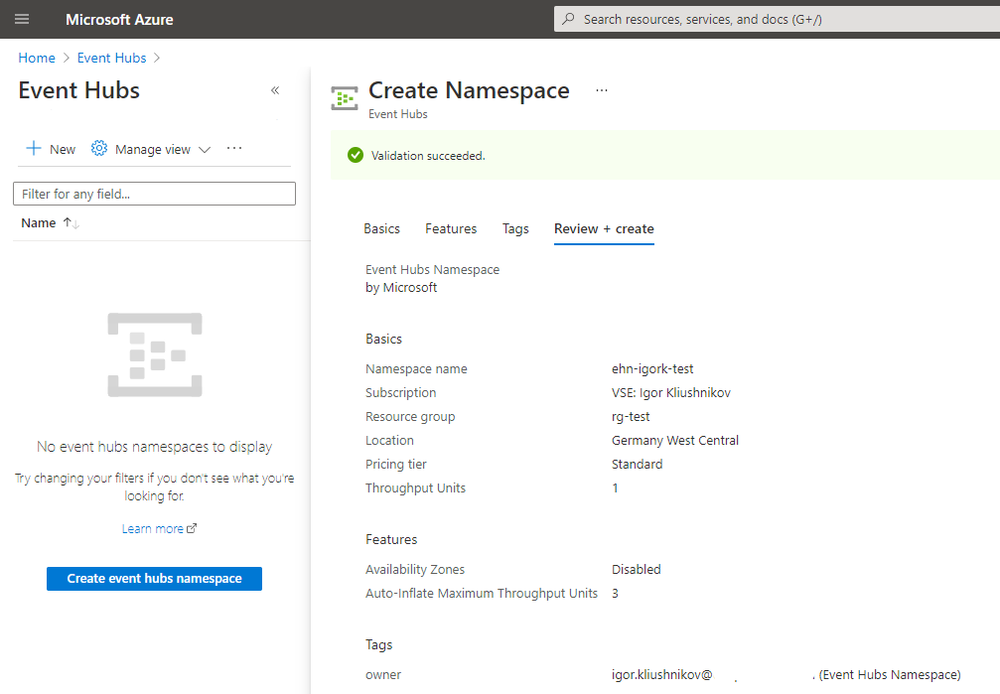
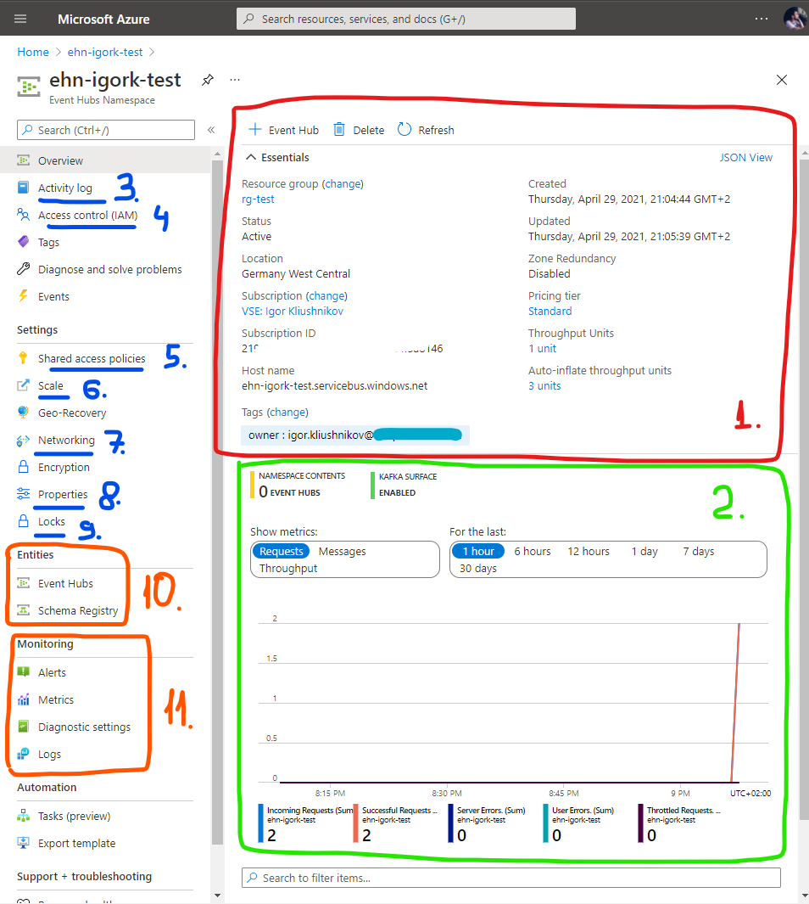
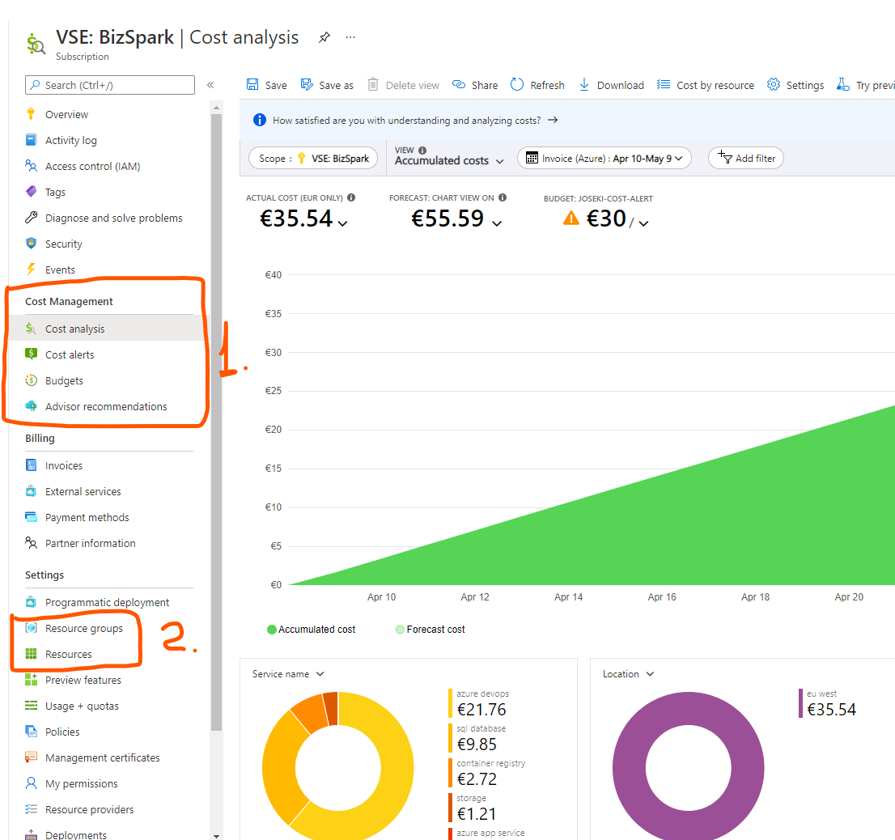
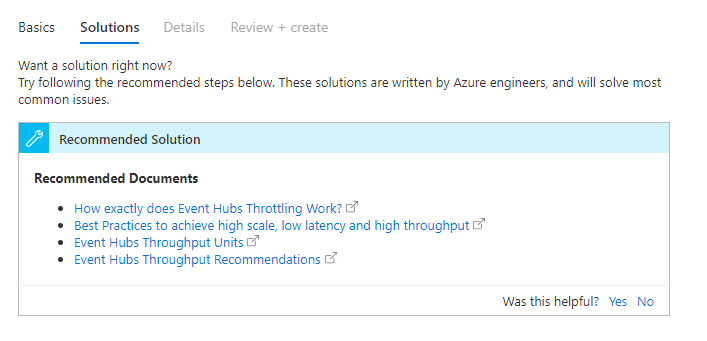

# Azure Cloud web interface

The goal: take a first look at Azure Cloud.

1. Find resources

    

    In most cases needed resource could be found with help of free-text-search texbox at the top of the screen `1`.

    You can also use a hamburger menu at the top-left corner to oped ***All services*** view via steps `2` and `3`. ***All services*** groups all available services into categories and also gives a *Filter* option.

    If most of the time you work with a subset of services, you can add them to ***Favorites*** `4`. To accomplish that, find a service in ***All services*** view, hover the mouse on it and wait for pop-up to appear, then press *star* icon:

    

2. Marketplace

    Azure offers third-party suppliers and central place to showcase their offerings - Marketplace.

    

    When you search item in a search-box, Azure also suggests marketplace-offerings.

    You can also open just a Marketplace to see grouped by category all the available applications.

3. Create resource

    Press `+` button at Home page or at any resource-type page to create a new resource:

    

    Create a new Event Hub Namespaces: generate new resource group, choose pricing tier `Standard` to enable auto-inflate (on Features tab):

    

    Note, some resources should be unique across the entire Azure Cloud, some - across your subscription only.

    Note, during deployment you can get pre-generated ARM template.

4. Show created resource

    Open created resource:

    

    1. ***Essentials*** view often highlight the most important and most used parts of resoruce description. Note, when you hover mouse on, it suggest copy-to-clipboard.

    2. Below are often located monitoring dashboards. Note, if you click on chart, it allows editing.

    3. ***Activity log*** highlights what users/entities did any action with your resource.

    4. ***Access control (IAM)*** allows to edit who can do what with resource and **check your roles within this resource scope**.

    5. ***Shared access policies*** creates/edits secrets/keys to access the resource.

    6. ***Scale*** allows to scale the resource without re-creating it.

    7. ***Networking*** configures firewalls, network access.

    8. ***Properties*** contains system information which is often needed for cli commands or automation scripts.

    9. ***Locks*** could block resource from changes or deletion.

    10. Resource level entities. In case of Event hub namespace it can manage Event Hubs (e.g. kafka topic) and Schema Registry.

    11. ***Monitoring*** tabs: query logs, visualize metrics, define alerts.

5. Show subscription

    In subscription view there are a lot of views and data, but let's focus on two:

    

    1. ***Cost Management*** gives a tool to monitor your spendings, set alerts and define budget.

    2. ***Resource groups*** and ***Resources*** gives a quick path to resources inside this single subscription.

6. Support Request and troubleshooting

    All resources have ***Support + troubleshooting*** tab. If you define your issue criteria, Azure portal might suggest documentation, dashboards, troubleshoot steps. If you have paid support, you can also leave a support-request.

    
