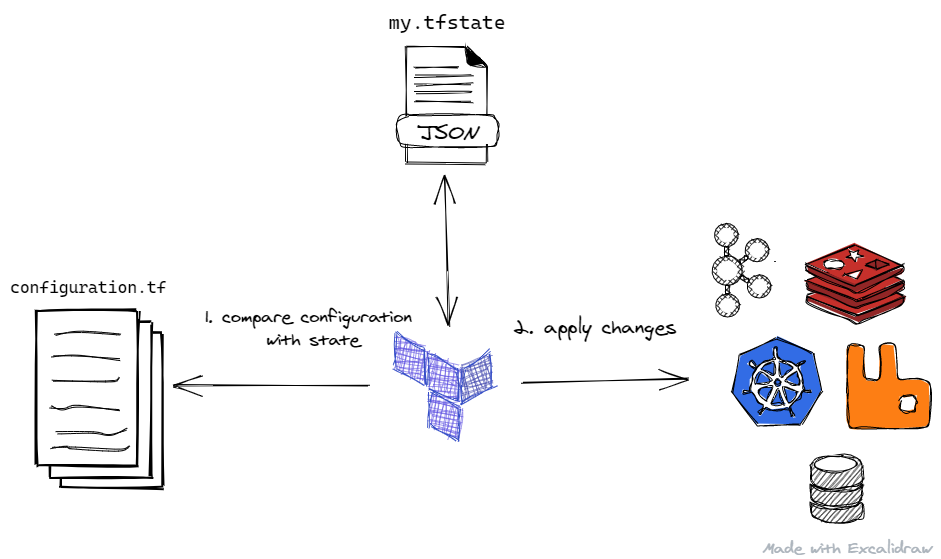

# Introduction to terraform

The goal: show main terraform commands and how to use templates from this repository

1. How to run the commands

    The repository supports [VSCode remote containers](https://code.visualstudio.com/docs/remote/containers). `.devcontainer` directory contains a ready-to-go profile and dockerfile with required dependencies to run all the samples.

    You can run all the commands:

    - on your own environment, then you have to install all the used tools (terraform, az-cli, az-func, etc)
    - inside VSCode Remote Container, then you have to install docker and VSCode extention [Remote Development](https://marketplace.visualstudio.com/items?itemName=ms-vscode-remote.vscode-remote-extensionpack).

2. What is terraform

    [Terraform](https://www.terraform.io/) is software which helps to describe *infrastructure as code* and manage it's lifecycle: plan, create, delete. If you are not familiar with terraform, after going through this demo check the complete [getting-started tutorial](https://learn.hashicorp.com/terraform).

    `terraform` transforms human-readable configuration into a state file, which applies then to external resources (e.g. Azure Cloud):

    

3. Basic commands

    0. Login to your Azure Cloud: `az login --use-device-code` and set your default subscription: `az account set -s SUBSRIPTION_ID`.

    1. Navigate to directory with terraform configuration: `cd src/terraform/02-what-is-cloud`

    2. Initialize terraform: `terraform init`

    3. Create `terraform.tfvars` file. This file contains your unique properties for the rest of terraform configuration. You can use a sample generator script: `../generate_tfvars.sh`

    4. Plan: `terraform plan -out whatiscloud.tfplan`

    5. If you are happy with proposed plan, deploy the infrastructure: `terraform apply "whatiscloud.tfplan"`. Browse resources in Azure portal after creation.

    6. Check terraform state file

        Highlight that state has sensitive data

    7. Find created resources in Azure Portal

    8. Change Storage account required TLS version and apply changes.

        Add `min_tls_version = "TLS1_2"` at line 21 in file `src/terraform/02-what-is-cloud`

        Alternatively to running plan and apply in separate commands, it is possible to execute just `terraform apply`

        Check the resource state at Azure Portal.

    9. Try changing the `prefix` variable and then plan: `terraform plan`

    10. Clean up created resources: `terraform destroy`
