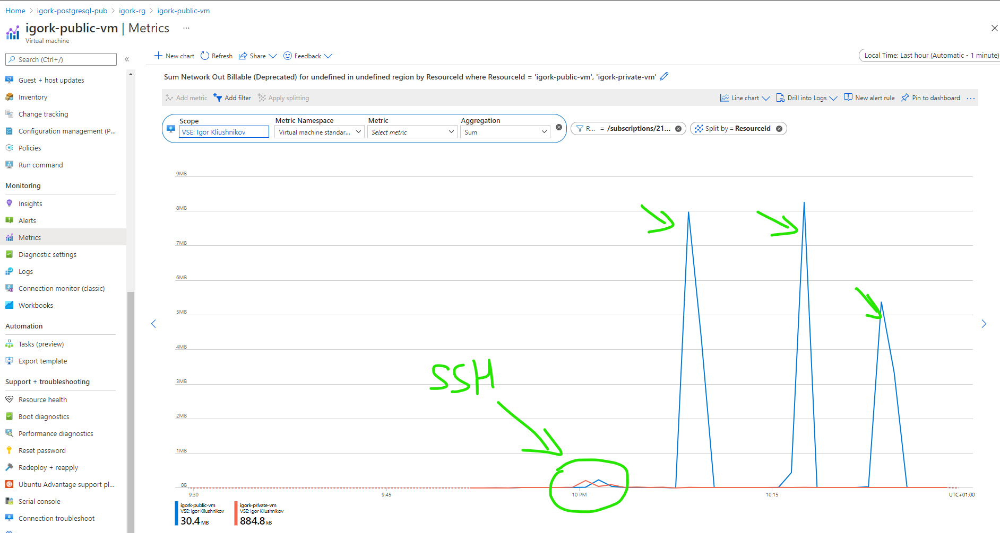

# Show Azure Networking Services

The goal: show Azure Networking Services

As provisioning VMs and Postgres takes a while, it's suggested to trigger initial terraform apply and while it's executing review the code.

## VMs, Postgres, and everything in between

1. Login to azure `az login` and select Subscription `az account set -s $SUBSCRIPTION_ID`

2. Change working directory to: `cd src/terraform/05-core-services-networking`

3. Create `terraform.tfvars` file. This file contains your unique properties for the rest of terraform configuration. You can use a sample generator script: `../generate_tfvars.sh`

4. Review proposed terraform configuration:

  - create two VMs and two PSQL instances
  - one VM communicates with PSQL via public interface. VM public IP is added to PSQL firewall rules
  - the second VM uses PSQL private endpoint and all the traffic does not leave Azure data-center

5. Provision Azure components via terraform

```sh
terraform init
terraform apply
```

NOTE: Public IP Address (PIP) for *private_vm* has `Dynamic` allocation type, which means that Azure allocates actual IP only after the PIP is attached to real resource (e.g. VM). Thus, after first `terraform apply` output value for `private_vm_ip` property will be empty. You can check this in state file, then rerun `terraform apply`, then check the state file again.

6. Parse terraform output: save private key and environment variables:

```sh
terraform output -raw tls_private_key > ~/id_psql_test
chmod 400 ~/id_psql_test
export PRIVATE_VM_IP=$(terraform output -raw private_vm_ip)
export PUBLIC_VM_IP=$(terraform output -raw public_vm_ip)
export PRIVATE_PSQL_HOSTNAME=$(terraform output -raw private_psql_hostname)
export PUBLIC_PSQL_HOSTNAME=$(terraform output -raw public_psql_hostname)
export PSQL_ADMIN=$(terraform output -raw psql_admin_name)
export PSQL_PASS=$(terraform output -raw psql_password)
```

### Perform tests

To perform tests, you have to connect to each vm with corresponding commands
- `ssh -t -i ~/id_psql_test adminuser@$PRIVATE_VM_IP PSQL_HOSTNAME=$PRIVATE_PSQL_HOSTNAME PGUSER=$PSQL_ADMIN PGPASSWORD=$PSQL_PASS bash -l`
- `ssh -t -i ~/id_psql_test adminuser@$PUBLIC_VM_IP PSQL_HOSTNAME=$PUBLIC_PSQL_HOSTNAME PGUSER=$PSQL_ADMIN PGPASSWORD=$PSQL_PASS bash -l`

Once you are connected to a VM run the commands:

```sh
sudo apt update && sudo apt upgrade -y && sudo apt-get install -y postgresql-client postgresql-contrib

pgbench -i "host=$PSQL_HOSTNAME.postgres.database.azure.com port=5432 dbname=exampledb sslmode=require"

# 3 client, 60 seconds, run transactional commands
pgbench "host=$PSQL_HOSTNAME.postgres.database.azure.com port=5432 dbname=exampledb sslmode=require" -c 3 -T 60

# 3 client, 60 seconds, select-only
pgbench "host=$PSQL_HOSTNAME.postgres.database.azure.com port=5432 dbname=exampledb sslmode=require" -c 3 -T 60 -S
```

Test connecting:
- from "private VM" to "public psql"
  ```sh
    ssh -t -i ~/id_psql_test adminuser@$PRIVATE_VM_IP PSQL_HOSTNAME=$PUBLIC_PSQL_HOSTNAME PGUSER=$PSQL_ADMIN PGPASSWORD=$PSQL_PASS bash -l

    host=$PSQL_HOSTNAME.postgres.database.azure.com
    echo $host
    pgbench -i "host=$host port=5432 dbname=exampledb sslmode=require"
  ```
- from "public VM" to "private psql"
  ```sh
    ssh -t -i ~/id_psql_test adminuser@$PUBLIC_VM_IP PSQL_HOSTNAME=$PRIVATE_PSQL_HOSTNAME PGUSER=$PSQL_ADMIN PGPASSWORD=$PSQL_PASS bash -l

    host=$PSQL_HOSTNAME.postgres.database.azure.com
    echo $host
    pgbench -i "host=$host port=5432 dbname=exampledb sslmode=require"
  ```

### Check results

Open Log Analytics and query:

```kusto
AzureDiagnostics
| project TimeGenerated, Resource, Message
| where Message has "connection received"
| where Message !has "connection received: host=[local]"
| where Message !has "connection received: host=127.0.0.1"
| take 1000
```

TODO: Billable Network VM metric is deprecated. Find another way to show the traffic price :(

Open any VM resource
- open `Metrics` tab
- select `Network Out Billable`
- select both VMs as scope:



### Clean up

Remove created resources: `terraform destroy`
