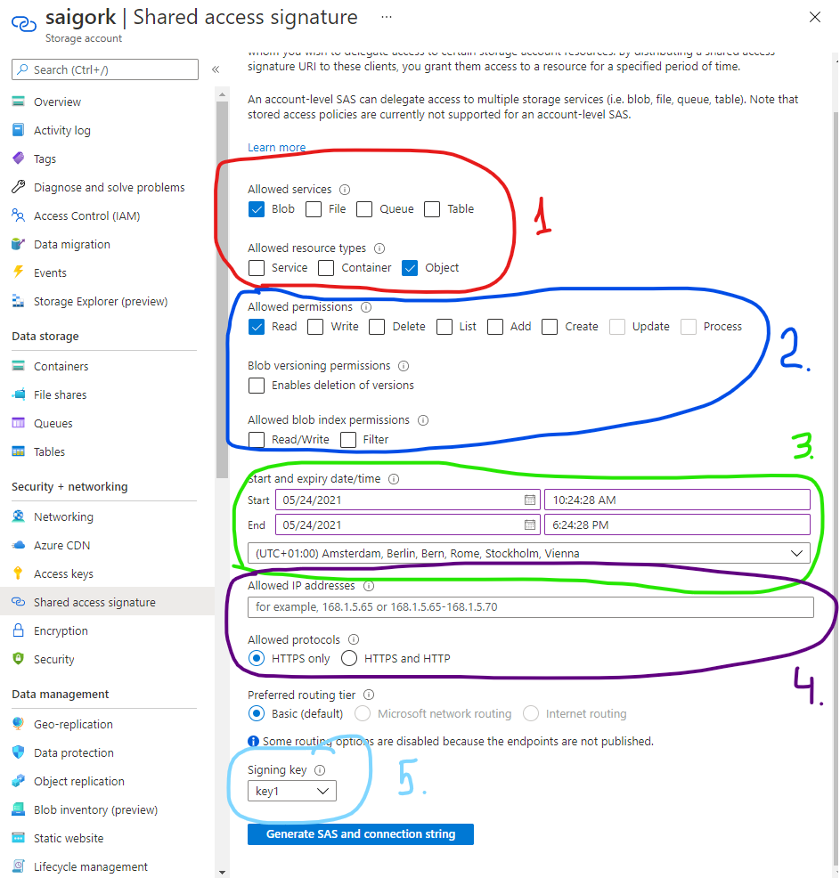
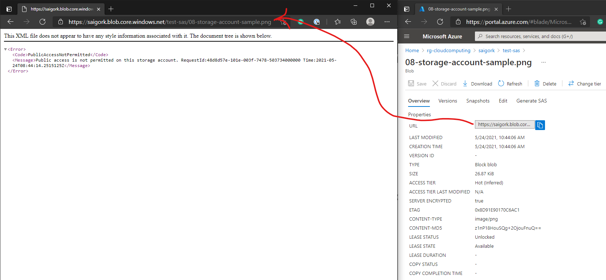
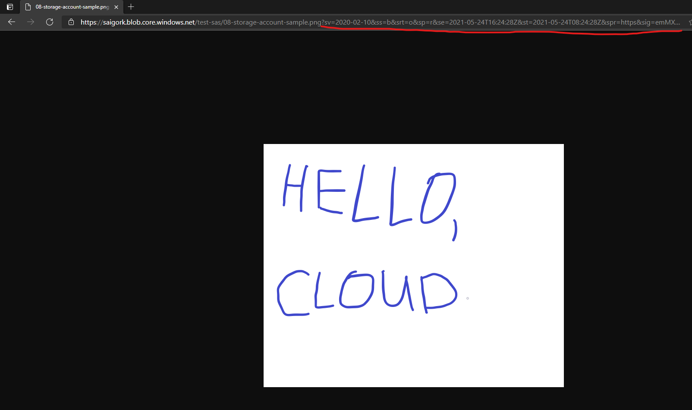
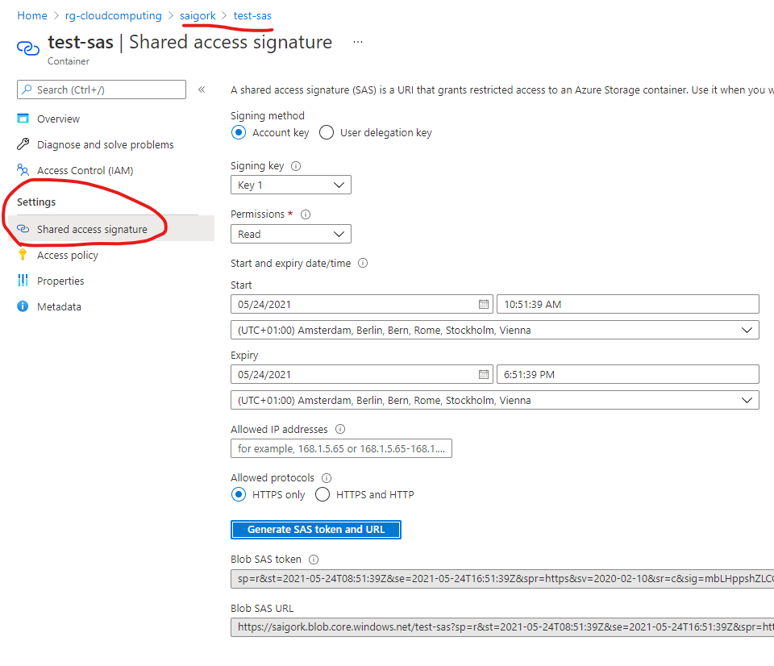
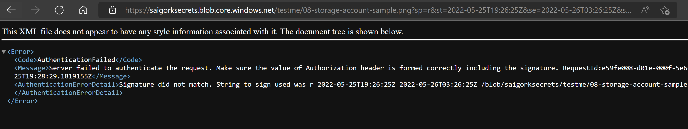
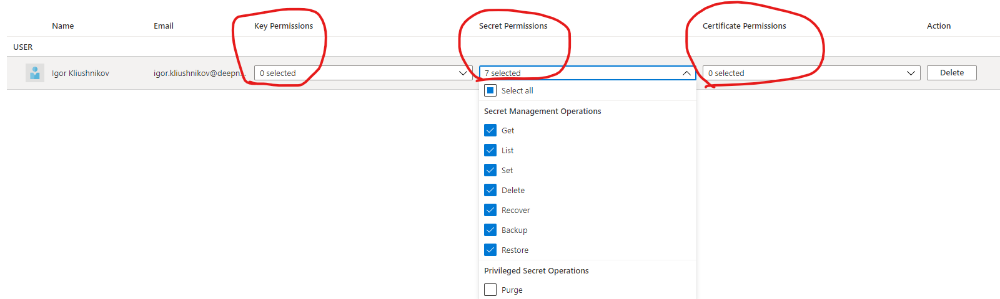
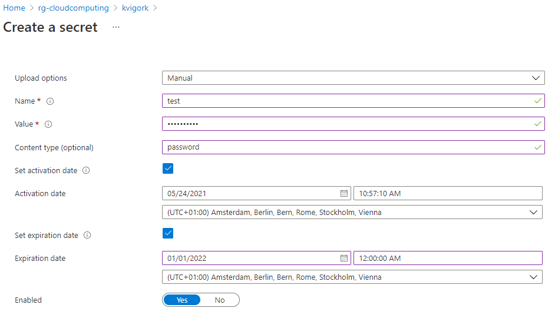

# Secrets management

The goal: basic secrets-management operations.

1. Create any Azure Storage Account and Azure Key Vault

2. Secrets types in Azure Storage Account

    - Access Key

        - give the key to the kingdom: you can do **everything**. It's better not to use for anything except signing short-lived SAS tokens.
        - could be rotated (for example, if it leaked)
        - there are two keys to offer zero-downtime operations: you can switch your consumers from key1 to key2 and only then rotate the key1

    - SAS (shared access signatures) token:

        1. scoped to exact resource type,
        2. allows only defined subset of operations,
        3. has start and expiration dates,
        4. firewall rules
        5. signed by Access Key

        

    (out of scope) you can also use [RBAC](https://docs.microsoft.com/en-us/azure/storage/blobs/data-lake-storage-access-control-model#role-based-access-control-azure-rbac) and [ACL](https://docs.microsoft.com/en-us/azure/storage/blobs/data-lake-storage-access-control) to grant access to particular Azure Active directory entities.

3. Test SAS token usage

    - create any container and upload a sample file there `files/06-12-security/08-storage-account-sample.png`
    - try to open this file url in browser
    
    

    - generate SAS token and prepend token to the same url, for example `sp=r&st=2021-05-24T08:47:28Z&se=2021-05-24T16:47:28Z&spr=https&sv=2020-02-10&sr=c&sig=G8ii...`.
    
    

    Note, SAS token could be generated on container or file level view too.

    

    - rotate the access key, which was used to sign the token, then try to reload the picture after a few minutes (or open in incognito view)

    

4. Controlling access to Azure Key Vault

    - Key Vault access could be controlled via custom [access-policies](https://docs.microsoft.com/en-us/azure/key-vault/general/assign-access-policy-portal) or [Azure RBAC](https://docs.microsoft.com/en-us/azure/key-vault/general/rbac-guide)

    - Add Access Policy to access only Secrets:

    

    - Try to open `Keys` or `Certificates` tab and notice `You are unauthorized to view these contents` error

    - Open secrets tab and generate a new secret:

    

    - Now, only identities that are listed in Access Policies can _read_ the secret.

5. Key/Secret Vault use case:

    - administrator user or application has a permission to create new secrets or update existing ones
    - consumer user or application has a permission only to list/read secrets
    - administrator generates a temporary (for example, 24 hours) SAS token to read and upload data within a Storage Account container
    - administrator uploads the secret into Key Vault
    - consumers read secret from Key Vault and use it to access the data
    - some time before secret expires, you generate a new SAS token and upload it to the same Key Vault
    - if consumer gets `403` response from Storage Account, they gets secret from Key Vault again.

    Disclaimer-1: You can automate [secrets rotation using FaaS and Event Grid](https://docs.microsoft.com/en-us/azure/key-vault/secrets/tutorial-rotation-dual):

    

## Summary

- use scoped keys
- limit consumers access to secrets
- rotate keys frequently
