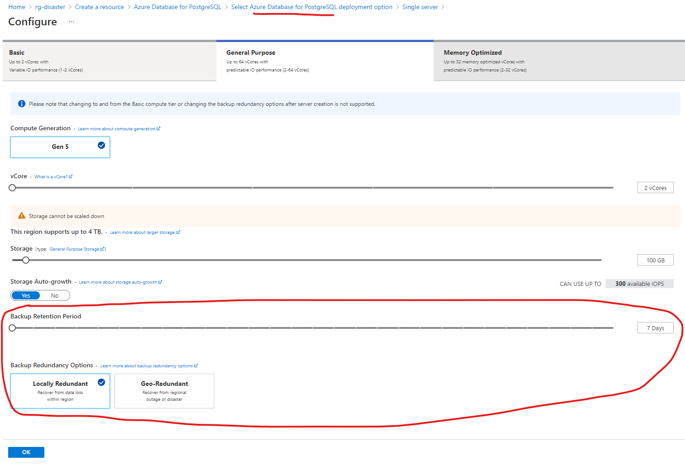

# Disaster recovery

The goal: introduction into disaster recovery

Disclaimer: the following section gives only a brief introduction into the topics and propose a few low-hanging fruits to get started.

1. A cloud often offers disaster-recovery tools from the box:

    - Replication
    - Backup redundancy options
    - Retention policies
    - Restore operations

2. For example, when you create Azure Postgres service, you can choose backup retention and redundancy:

    

3. For critical data, consider doing periodic backups into another cloud/service.

4. **Always create and regularly test** recovery [runbooks](https://www.pagerduty.com/resources/learn/what-is-a-runbook/): steps to perform data restore.

5. A cloud often proposes point-in-time restore, when you can choose exact point of time within your backup-retention policy.
