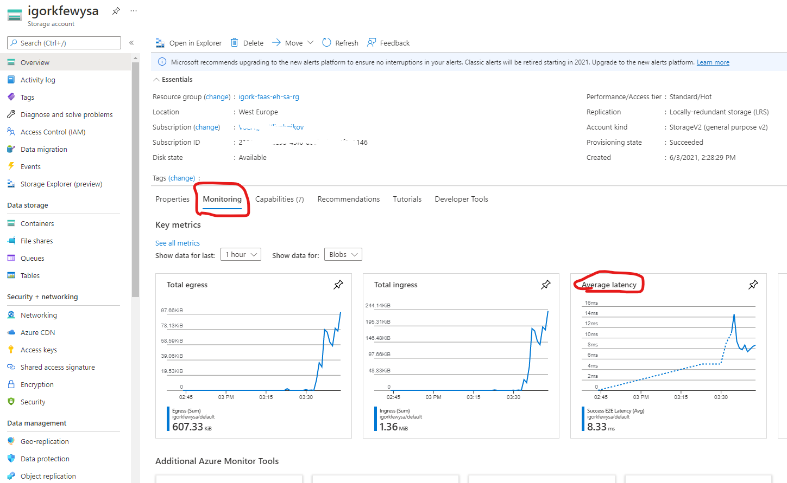
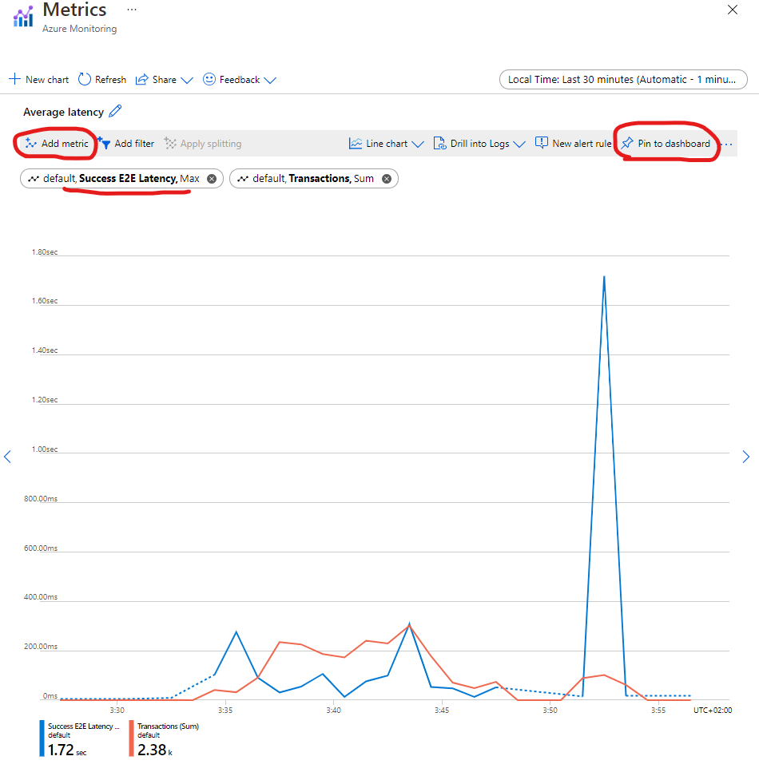
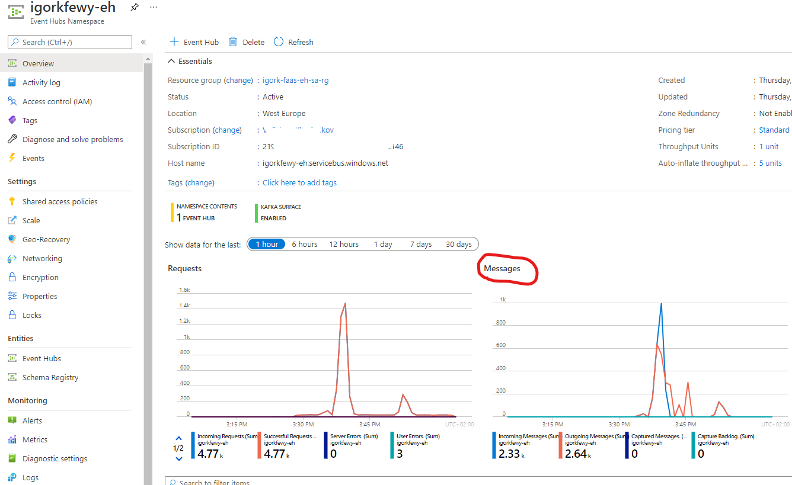
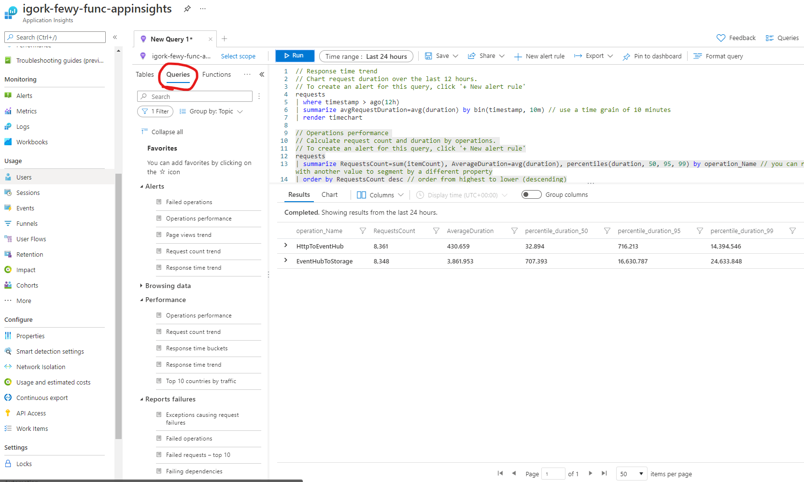
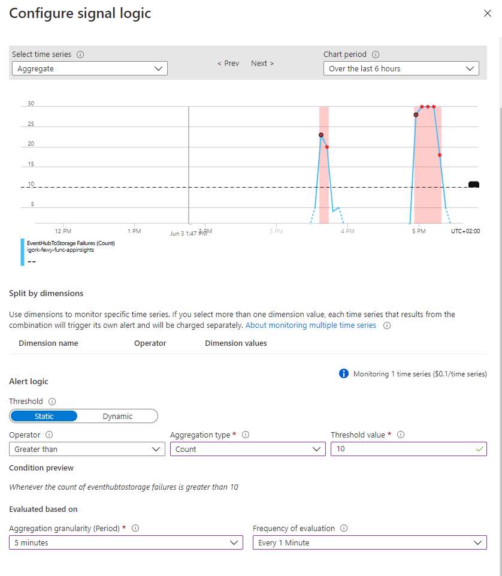

# Logging, Metrics, Traces, Observability

The goal: show structured and plain-text logs, metrics and dashboards, all-in-one solutions

## Prepare working environment

1. Start kubernetes cluster: `minikube start -n 3`

2. Login to azure `az login` and select Subscription `az account set -s $SUBSCRIPTION_ID`

3. Change working directory to: `cd src/terraform/all_in_one`

4. Create `terraform.tfvars` file. This file contains your unique properties for the rest of terraform configuration. You can use a sample generator script: `../generate_tfvars.sh`

5. Provision Azure components via terraform

```sh
terraform init
terraform apply
```

6. Parse terraform output to environment variables that will be picked up by azure-function locally:

```sh
export AzureWebJobsStorage=$(terraform output -raw azure_web_jobs_storage)
export eventHubName=$(terraform output -raw event_hub_name)
export CloudComputingEventHubConnectionString=$(terraform output -raw event_hub_connection_string)
export StorageAccountConnectionString=$(terraform output -raw storage_account_connection_string)
export StorageAccountContainerName=$(terraform output -raw storage_account_containername)
export FUNCTION_APP_NAME=$(terraform output -raw azure_function_name)
```

## Deploy the function

1. Change working directory to function sources: `cd ../../az_func`

2. Create and activate virtual environment

```sh
python3 -m venv .venv
source .venv/bin/activate
pip install -r requirements.txt
```

3. Deploy function to Azure: `func azure functionapp publish $FUNCTION_APP_NAME --python`. Note, it takes _some time_ to finish the process.

4. Ingest events with load-generator tool `k6`

    - `cd src/load_generator`
    - Update `src/load_generator/script.js` with function URL from function-publish output or from Code+Test view at Azure Portal, for example: `https://cloudcomp-ex4f-func.azurewebsites.net/api/HttpToEventHub?code=Q3NoO2M4LmARBdh/nAcRe0Giaa0yKrVBMN6bbQQZ9ZaVxqyvBXRXKg==`
    - test function: `docker run -i loadimpact/k6 run -d 2m - <script.js`

## Unstructured (plaintext) logs

Review plain-text logs in kubernetes

1. Get logs from a container: `kubectl logs kube-apiserver-minikube -n kube-system`

2. Filter logs:

    - `kubectl logs kube-apiserver-minikube -n kube-system | grep 'url'`
    - `kubectl logs kube-apiserver-minikube -n kube-system | grep 'url' | grep -v 'kindnet'`

3. (Optional) the same filtering in k9s:

    - tail logs from `kindnet` daemon-set
    - filter logs via `/ !current` or `/ minikube-m`

## Structured logs

Review structured logs in Azure Log Analytics

1. Open `Log Analytics workspace/Logs` and query sample logs `AzureDiagnostics`

2. Slice and dice logs:

    - filter-out: `AzureDiagnostics | where LogicalServerName_s <> "cloudcomp-postgresql-pub" | take 10`
    - order: `AzureDiagnostics | order by TimeGenerated desc | take 10`
    - project: `AzureDiagnostics | project TimeGenerated, Message | take 10`
    - visualize:
        ```sql
        AzureDiagnostics 
        | summarize AggregatedValue = count() by bin(TimeGenerated, 5m), LogicalServerName_s 
        | render timechart
        ```

## Metrics and Dashboards

1. Add Storage Account metrics to a dashboard:

    1. Open Storage Account and click on Monitoring/Latency chart:

    

    2. Click on Success E2E Latency and change aggregation to `max`

    3. Add Sum of Transactions metric

    4. Pin to a new dashboard
    
    

2. Add Event Hub metrics to a dashboard:

    1. Open Event Hub `Messages` chart

    
    
    2. Delete both `Captured Messages` metrics

    3. Pin to existing `FaaS` dashboard

3. Add Function metrics to a dashboard:

    Open Application Insights and pin to `FaaS` dashboard request/responce charts:
    
    

4. Edit dashboard:

    1. Place charts in order you like

    2. Press `Customize tile data` on each chart and uncheck `Override the dashboard time settings`

    3. Rename Charts if needed
    
    

## Function observability

1. Start load-generator: `docker run -i loadimpact/k6 run -s 10s:1 -s 30s:5 -s 2m:10 -s 1m:5 -s 30s:1 - <script.js`

2. Open `Live Metrics`:

    Note, changing amount of servers and their load, telemetry flow, request duration and rates. Highlight, that when load-generator finishes - requests are still flowing.

    

3. Open `Performance` tab:

    1. Show request duration distribution
    2. Highligh Operations summary. Likely, `HttpToEventhub` is much slower
    3. Highlight Dependencies: Storage account is not shown there (because it's not instrumented)
    4. Show Roles: misc servers might have different performance

    

4. Open `Failures` tab:

    1. Highlight Operations: failures by function
    2. Drill-down to exact failure: traces, telemetry, error properties
    3. Dependencies: failure by dependency
    4. Exceptions: group by exception type
    5. Roles: group by server, filter by server

    

5. Open `Logs` tab. Show built-in queries:

    

6. Open `Usage and estimated costs` tab. If pricing goes mad - sample, change retention, set daily-cap.

7. Open Dashboard from previous exercise. Note, requests are still in progress even though load-generator is idle for a while.

## Alerts

1. Open Application Insights `Alerts` tab and press `Create Alert`.

2. Press `Add condition` and select signal `EventHubToStorage Failures (Azure.ApplicationInsights)`

3. Select operator `Greater than` with aggregation `Count`. Show how threshold and evaluation period changes outcome:

    

4. Create Action group with email

5. Enter name, severity and save changes

6. Show newly created alert in `Manage Alert rules` tab

7. Generate load: `docker run -i loadimpact/k6 run -s 10s:1 -s 30s:5 -s 1m:10 -s 1m:5 -s 30s:1 - <script.js`

8. Show alert in Azure Portal and email:

    

## Clean-up

1. Delete created `FaaS` dashboard.

2. Delete created cloud components: `terraform destroy`.

3. Stop kubernetes cluster: `minikube stop`.
