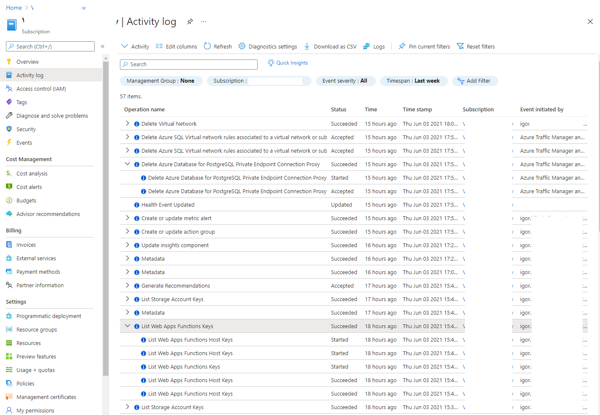

# Audit

The goal: cloud audit introduction

1. Open Subscription `Activity log` tab

    Audit log highlights who, did what, and when.

    Note, some entries might have several child records:

    

2. When you click on an entry, you can get a detailed json description and shortcut to create an alert:

    

3. Some _complex_ applications might have own audit capabilities that has to be enabled and configured separately. For example, [Azure Active Directory](https://docs.microsoft.com/en-us/azure/active-directory/reports-monitoring/howto-analyze-activity-logs-log-analytics), [Azure Kubernetes Service](https://docs.microsoft.com/en-us/azure/aks/view-control-plane-logs), [Storage Account](https://docs.microsoft.com/en-us/azure/storage/blobs/monitor-blob-storage), and others.